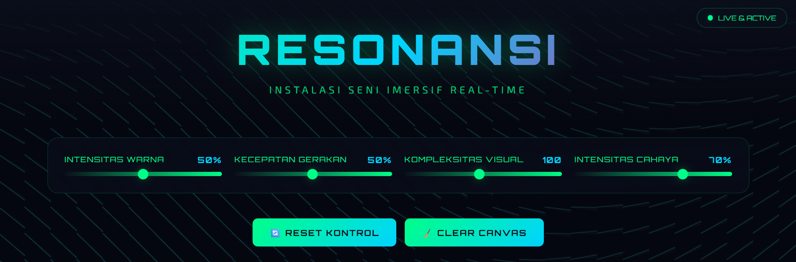
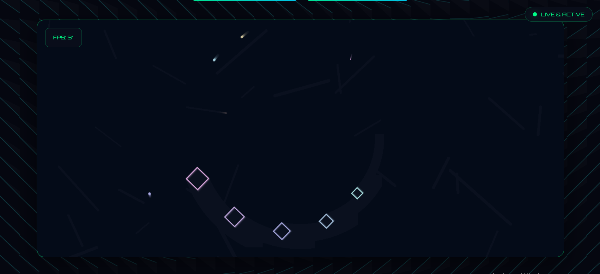
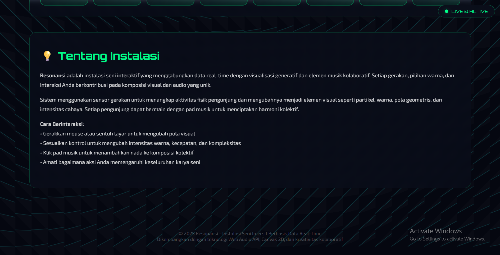

# 🎨 RESONANSI

**Instalasi Seni Imersif Berbasis Data Real-Time**

---

## 📋 Deskripsi

**Resonansi** adalah instalasi seni digital interaktif berbasis web yang menggabungkan visualisasi generatif real-time dengan musik kolaboratif. Sistem merespons gerakan pengunjung (mouse/touch) untuk menciptakan pola visual dinamis berupa partikel, warna, dan geometri yang unik. Pengunjung juga dapat berinteraksi dengan 8 pad musik untuk menciptakan komposisi audio bersama.

Setiap sesi menghasilkan karya seni yang berbeda, menjadikan pengalaman setiap pengunjung unik dan personal. Proyek ini menunjukkan bagaimana teknologi dapat menciptakan pengalaman seni yang edukatif, ekspresif, dan mampu memperkaya interaksi sosial.

---

## ✨ Fitur Utama

### 🎨 **Visualisasi Generatif**
- **Particle System Real-Time** - Sistem partikel dinamis yang merespons input pengguna
- **Animated Background** - Grid pattern dengan wave animation yang bergerak mengikuti tempo
- **Geometric Shapes** - Pola geometris yang berputar dan bergerak secara dinamis
- **Color Gradient Effects** - Efek gradien warna dengan HSL manipulation untuk transisi yang smooth
- **Smooth Animations** - 60 FPS rendering untuk pengalaman visual yang halus dan responsif

### 🎵 **Musik Interaktif**
- **8 Music Pads** - Nada C4 (261 Hz), D4 (293 Hz), E4 (329 Hz), F4 (349 Hz), G4 (392 Hz), A4 (440 Hz), B4 (493 Hz), C5 (523 Hz)
- **Web Audio API** - Sintesis audio real-time dengan oscillator dan gain control
- **Note Frequency Display** - Tampilan frekuensi untuk setiap nada dalam Hertz
- **Visual Feedback** - Animasi dan perubahan warna saat pad diklik
- **Sound Synthesis** - Sine wave generator dengan envelope control untuk kualitas audio yang jernih

### 🎛️ **Kontrol Interaktif**
- **Intensitas Warna** (0-100%) - Mengubah palet warna visualisasi dari monokrom hingga spektrum penuh
- **Kecepatan Gerakan** (1-100%) - Mengatur tempo animasi dari sangat lambat hingga sangat cepat
- **Kompleksitas Visual** (10-200) - Menambah atau mengurangi jumlah elemen visual yang ditampilkan
- **Intensitas Cahaya** (0-100%) - Mengatur brightness dan mood dari gelap hingga terang

### 📊 **Statistik Real-Time**
- **Partisipan Aktif** - Jumlah pengunjung yang sedang berinteraksi dengan instalasi
- **Total Interaksi** - Tracking semua mouse movement, touch events, dan click interactions
- **Level Energi** - Persentase aktivitas pengunjung berdasarkan frekuensi interaksi
- **Partikel Aktif** - Jumlah partikel yang sedang di-render pada canvas saat ini

### 🎮 **Action Buttons**
- **Reset Kontrol** - Mengembalikan semua slider ke nilai default (50%, 50%, 100, 70%)
- **Clear Canvas** - Membersihkan semua partikel dari canvas untuk memulai fresh

### 📱 **Responsive Design**
- **Desktop Optimization** - Full experience dengan mouse interaction dan hover effects
- **Touch Support** - Optimized untuk tablet dan smartphone dengan touch events
- **Adaptive Layout** - Auto-adjust untuk berbagai ukuran layar (desktop, tablet, mobile)
- **Cross-browser Compatible** - Berfungsi optimal di Chrome, Firefox, Safari, dan Edge

---

## 🚀 Demo

### 🌐 Live Demo
**URL:** [https://your-website-url.com]([https://your-website-url.com](https://github.com/231220148-glitch/RESONANSI.git))

> Kunjungi website untuk merasakan pengalaman interaktif secara langsung!

---

## 📸 Screenshots

### Homepage & Interface

*Tampilan utama dengan header, control panel, dan interactive canvas*

### Interactive Canvas

*Visualisasi partikel dinamis saat user berinteraksi dengan mouse movement*

### Music Pads

*8 music pads interaktif dengan frequency display untuk setiap nada*

### Statistics Dashboard

*Real-time metrics dashboard dengan 4 key performance indicators*

---

## 🛠️ Teknologi

### Frontend
- **HTML5** - Struktur semantic dan Canvas API untuk rendering grafis
- **CSS3** - Modern styling, animations, transitions, dan responsive design
- **JavaScript ES6+** - Core logic, OOP dengan classes, dan real-time interactivity

### APIs & Libraries
- **Web Audio API** - Audio synthesis, oscillators, dan sound generation real-time
- **Canvas 2D API** - High-performance graphics rendering dan particle system
- **DOM Events API** - Mouse, touch, keyboard interactions, dan event handling

### Typography
- **Orbitron** (Google Fonts) - Display font untuk heading dengan style futuristik
- **Exo 2** (Google Fonts) - Body font untuk content dengan readability tinggi

---

## 📖 Cara Menggunakan

### 🖱️ Interaksi Mouse/Touch

#### Desktop (Mouse):
1. **Gerakkan mouse** di area canvas untuk menciptakan trail partikel yang mengikuti cursor
2. **Klik canvas** untuk membuat burst 20 partikel sekaligus dengan velocity acak
3. **Hover** pada controls untuk melihat tooltip informasi tambahan

#### Mobile/Tablet (Touch):
1. **Sentuh dan geser** jari di canvas untuk menciptakan partikel
2. **Tap** pada canvas untuk membuat burst partikel
3. **Touch** controls untuk menyesuaikan parameter

---

### 🎛️ Mengatur Kontrol

#### Intensitas Warna (0-100%)
Geser slider untuk mengubah palet warna visualisasi:
- **0-30%:** Warna monokrom dan gelap
- **31-70%:** Transisi gradual dengan spektrum terbatas
- **71-100%:** Full spectrum dengan warna vibrant

#### Kecepatan Gerakan (1-100%)
Atur tempo dan kecepatan animasi:
- **1-30%:** Slow motion, gerakan sangat lambat dan contemplatif
- **31-70%:** Medium speed, balance antara smooth dan dynamic
- **71-100%:** Fast motion, energik dan dinamis

#### Kompleksitas Visual (10-200)
Tambah atau kurangi jumlah elemen visual:
- **10-50:** Minimal, fokus pada beberapa elemen saja
- **51-150:** Medium, balance antara simple dan complex
- **151-200:** Maximum, banyak elemen dengan visual yang rich

#### Intensitas Cahaya (0-100%)
Sesuaikan brightness dan mood:
- **0-30%:** Dark mode, atmosfer misterius
- **31-70%:** Balanced lighting
- **71-100%:** Bright mode, energik dan cheerful

---

### 🎵 Bermain Musik

#### Music Pads:
1. **Klik pad musik** C, D, E, F, G, A, B, atau C5 untuk mendengar nada yang berbeda
2. **Coba kombinasi** nada untuk membuat melodi sederhana atau chord progression
3. **Perhatikan frekuensi** yang ditampilkan di setiap pad (dalam Hertz)
4. **Lihat animasi** visual saat pad diklik - partikel akan muncul seiring dengan suara

#### Tips Bermain Musik:
- Coba mainkan C-E-G untuk chord C Major
- Mainkan C-D-E-F-G-A-B-C5 untuk tangga nada naik
- Eksperimen dengan kombinasi acak untuk sound yang unik

---

### 🎮 Action Buttons

#### Reset Kontrol
Klik tombol **"🔄 Reset Kontrol"** untuk:
- Mengembalikan Intensitas Warna ke 50%
- Mengembalikan Kecepatan Gerakan ke 50%
- Mengembalikan Kompleksitas Visual ke 100
- Mengembalikan Intensitas Cahaya ke 70%

#### Clear Canvas
Klik tombol **"🧹 Clear Canvas"** untuk:
- Membersihkan semua partikel yang sedang di-render
- Memulai dengan canvas kosong
- Tidak mengubah setting kontrol yang sudah disesuaikan

---

## 🎯 Target Penggunaan

### 🏛️ Museum & Galeri Seni
- **Instalasi Permanen:** Display tetap sebagai bagian dari koleksi digital art
- **Instalasi Temporer:** Exhibition khusus untuk periode tertentu
- **Interactive Exhibit:** Atraksi interaktif untuk engage pengunjung
- **Educational Programs:** Tool untuk menjelaskan konsep art & technology

### 🎪 Event & Festival
- **Music Festivals:** Interactive art installation yang sinkron dengan musik
- **Technology Conferences:** Demo untuk showcase teknologi web modern
- **Art Exhibitions:** Feature installation untuk contemporary art shows
- **Public Engagement:** Aktivitas untuk melibatkan audience secara aktif

### 🏢 Corporate Spaces
- **Office Lobbies:** Welcome installation untuk visitor dan employee
- **Creative Studios:** Inspiration tool untuk creative teams
- **Innovation Centers:** Showcase untuk technology capabilities
- **Tech Company Showrooms:** Demo interaktif untuk client presentations

### 🎓 Kampus & Institusi Pendidikan
- **Art & Design Programs:** Teaching tool untuk interactive design principles
- **Computer Science Labs:** Demo untuk web technologies dan APIs
- **Student Exhibitions:** Platform untuk showcase student projects
- **Interactive Learning Spaces:** Hands-on learning experience tentang coding

---

## 👨‍💻 Author

Proyek ini dikembangkan oleh:

**Nabil Hany** & **Muhammad Fiqri Mahendra**

---

## 📞 Support & Contact

### Butuh Bantuan?
- 📧 Email: resonansi@artinstallation.com
- 🐛 Issues: Laporkan bug atau saran perbaikan
- 📖 Documentation: Panduan lengkap penggunaan

### Social Media
- 🐦 Twitter: [@ResonansiArt](https://twitter.com/ResonansiArt)
- 📸 Instagram: [@resonansi.art](https://instagram.com/resonansi.art)
- 🎥 YouTube: [Resonansi Channel](https://youtube.com/@resonansi)

---

## 🎯 Fun Facts

- 🎨 **10,000+** possible color combinations dengan HSL manipulation
- 🎵 **256** different melodies dapat diciptakan dengan 8 music pads
- ⚡ **60 FPS** rendering performance untuk smooth animations
- 📱 **100%** responsive design across all devices
- 🌍 **0** external dependencies (kecuali Google Fonts)
- 💾 **~50 KB** total file size (sangat lightweight)
- 🚀 **< 2 seconds** average load time
- ♻️ **100%** client-side processing (no backend needed)

---

### 🌟 Star this repo if you like it!

**Made with ❤️ and lots of ☕**

**© 2025 Resonansi - Where Art Meets Technology**

**Developed by Nabil Hany & Muhammad Fiqri Mahendra**

[⬆ Back to Top](#-resonansi)

